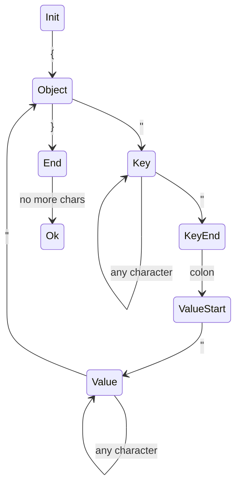

Handles Json with one key with string values

## states

| state      | `{`    | `}`   | No More Chars | Other | `"`    | `:`        |
| ---------- | ------ | ----- | ------------- | ----- | ------ | ---------- |
| Init       | Object | Error | Error         | Error | Error  | Error      |
| Object     | Error  | End   | Error         | Error | Key    | Error      |
| End        | Error  | Error | Ok            | Error | Error  | Error      |
| Key        | Key    | Key   | Error         | Key   | KeyEnd | Key        |
| KeyEnd     | Error  | Error | Error         | Error | Error  | ValueStart |
| ValueStart | Error  | Error | Error         | Error | Value  | Error      |
| Value      | Value  | Value | Error         | Value | Object | Value      |

Anything outside of this chart will error

## Todo

- [ ] handle escapes in strings
- [ ] make string state
- [ ] handle whitespace
- [ ] pull string logic into its own module
- [ ] empty string case
